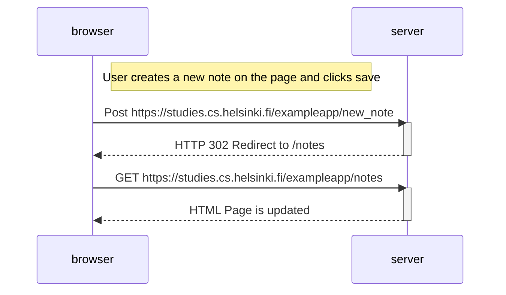

```mermaid
sequenceDiagram
    participant browser
    participant server

    Note right of browser:  User creates a new note on the page and clicks save
    browser->>server: Post https://studies.cs.helsinki.fi/exampleapp/new_note
    activate server
    server-->>browser: HTTP 302 Redirect to /notes
    deactivate server

    browser->>server: GET https://studies.cs.helsinki.fi/exampleapp/notes
    activate server
    server-->>browser: HTML Page is updated
    deactivate server
```
